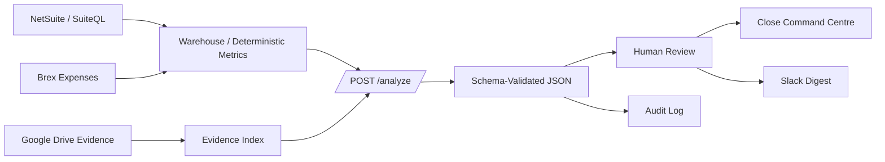

# Architecture

## System Boundary

This repository implements the API boundary and analysis contract for a Close Command Centre. It does not include a frontend, database, auth layer, or live finance-system integrations.

## Data Flow

1. A caller submits an analysis request to `POST /analyze`.
2. The service validates the request with Zod.
3. The analyzer retrieves or simulates deterministic finance context.
4. The analyzer produces a structured result.
5. The service validates the result with Zod before returning it.
6. A human reviewer decides whether to use the commentary or action drafts.

## Trust Model

Finance systems own numbers. The LLM does not calculate trial balances, determine final variance amounts, approve expenses, or close cases. It drafts and explains based on deterministic records.

## Human Review Points

- Before variance commentary is used in management reporting.
- Before AP follow-up messages are sent.
- Before any case status changes.
- Before any close readiness summary is shared as executive reporting.

## Mermaid Diagram

## Production Architecture Notes

Production should add auth/RBAC, live SuiteQL and Brex connectors, warehouse-backed metrics, durable audit logs, queues, tracing, rate limits, prompt/version registry, and reviewer feedback capture.
